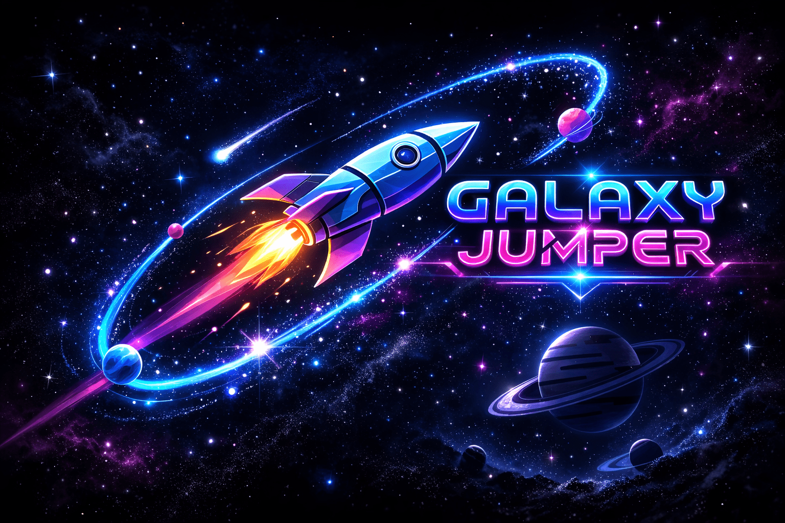

  

 Galaxy Jumper
​Galaxy Jumper is a high-octane, endless space survival game built with HTML5 Canvas and JavaScript. Navigate through a dangerous asteroid field, evade the Nebula Sentinels, and survive cosmic distortions to achieve the highest score.
​🎮 How to Play
​Controls
​Movement: Use the Left (←) and Right (→) arrow buttons to switch lanes.
​Jump: Tap the Up (↑) arrow to jump.
​Pro-Tip: Frequent jumping allows you to navigate tighter obstacle clusters.
​The Mission
​Avoid red and pink energy barriers. If you hit an obstacle or a Nebula Sentinel without a shield, your mission ends.
​✨ Features
​Choose Your Explorer
​Each character has a unique strategic advantage:
| Icon | Name | Special Ability |
| :--- | :--- | :--- |
| 💫 | Comet | Enhanced Agility (Standard) |
| 🌟 | Superstar | Magnet King (Pull coins from further away) |
| ⭐ | Smallstar | Double Coin Value (Economic Boost) |
| ⚡ | Pulse | High Speed (1.6x multiplier for experts) |
| ☀️ | Flare | Low Gravity (Easier landing) |
​Power-Ups
​🛸 Defense Drones: Automatically fires lasers at incoming obstacles.
​🧲 Magnetic Field: Pulls all nearby Stardust Coins toward you.
​🛡️ Energy Shield: Absorbs one hit from any hazard.
​💥 Supernova: Every 500 points, clear the entire screen of threats.
​Cosmic Hazards
​🌀 Nebula Clouds: Touching these will invert your controls and blur your vision.
​🛰️ Sentinels: Moving enemies that patrol the lanes.
​🛠️ Technical Breakdown
​Engine: Custom 2D/pseudo-3D engine using HTML5 Canvas.
​Audio: Procedural sound synthesis using the Web Audio API (no external .mp3 files needed!).
​Procedural Generation: An anti-pattern spawn engine ensures that every run is unique and fair.
​Responsiveness: Fully responsive design that adapts to mobile and desktop screens.
Click here to play ! [https://jashbhai634.github.io/Galaxy-Jumper/]
